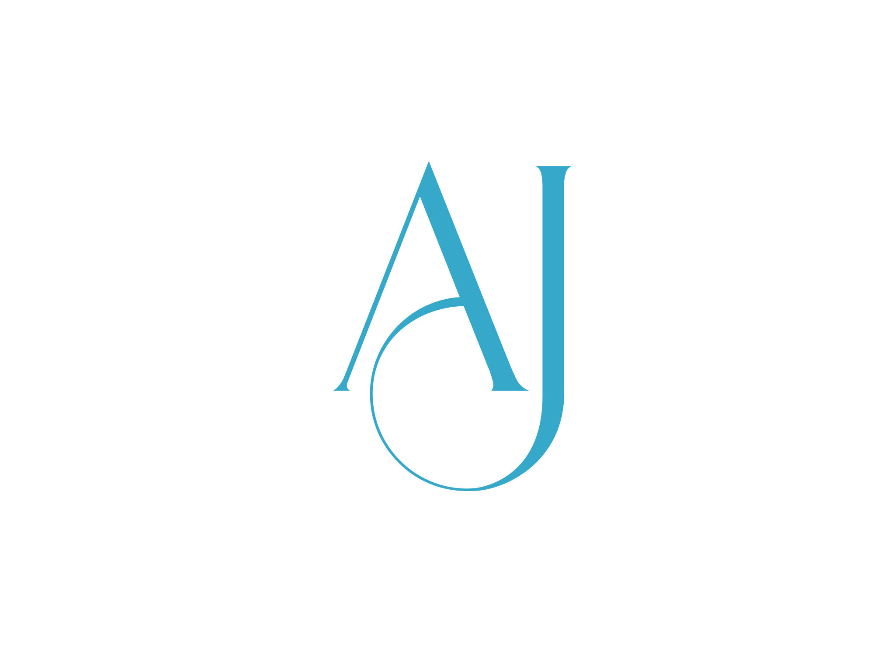

 

### ✍️ About me

- 🖥️ Hi, I’m Ajrass, a full-stack web developer with a background in network technology.
- 🚀 Passionate about creating robust and elegant web solutions.
- 🌱 I bring a blend of technical expertise and cultural competence to every project.
- 💡 It takes two holes to make a tunnel. Otherwise, it's just a cave! Let's build tunnels!

### 🎨 Front-end

 

### 💻 Back-end

### 🛠️ Tools

 

 

 

### 👨‍💻 Methods

### 📊 GitHub Stats

  
  

### 🏆 GitHub Trophies

  

  

 

 
  Total visits 
  

