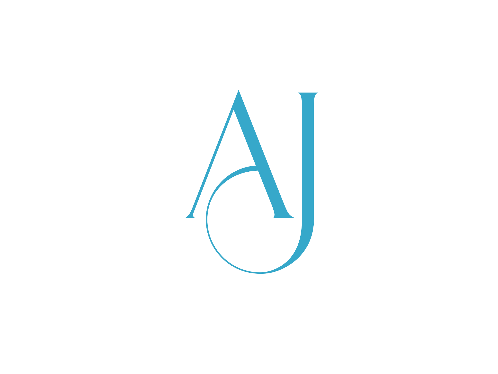

  

  

  
  
  
  
   
  

---

## ✍️ About me

- 🖥️ &nbsp;Hi, I'm **Ajrass** — a full-stack web developer with a background in network technology.
- 🧰 &nbsp;I build with **React / TypeScript** on the front end and **Rails**, **Node.js / Express** on the back end.
- 🗄️ &nbsp;Comfortable across **PostgreSQL**, **MongoDB** and **Prisma**, and I ship with **Docker**.
- 🚀 &nbsp;Passionate about creating robust and elegant web solutions.
- 🌱 &nbsp;I bring a blend of technical expertise and cultural competence to every project.
- 📫 &nbsp;Reach me through my [portfolio](https://ajrass-tajemouti.netlify.app/) or [LinkedIn](https://linkedin.com/in/ajrass/).
- 💡 &nbsp;*It takes two holes to make a tunnel. Otherwise, it's just a cave — let's build tunnels!*

---

## 🧰 Tech Stack

**Languages**

**Front-end**

**Back-end**

**Databases & ORM**

**DevOps & Tooling**

**Testing & Quality**

**Ways of working**

---

## 📊 GitHub Stats

  

  
  
  

  
  

---

## 🏆 GitHub Trophies

  <!-- Primary mirror. Fallback: https://github-trophies.devomb.com/?username=... -->
  

---

  
  
<i>Open to freelance work and collaboration — let's build something solid.</i>

